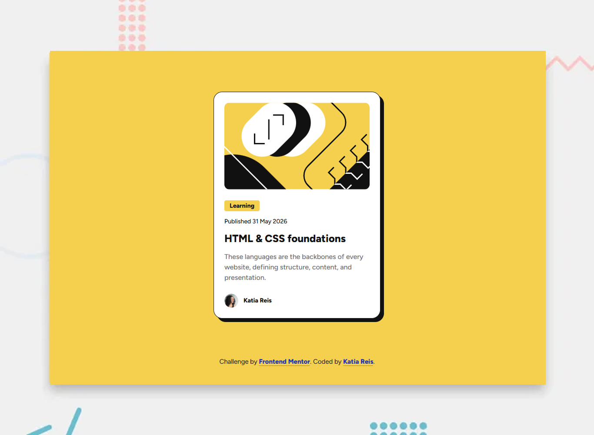

# Frontend Mentor - Blog preview card solution

Blog preview card - This small project builds out a blog post card with Semantic HTML and CSS

This is a solution to the [Blog preview card challenge on Frontend Mentor](https://www.frontendmentor.io/challenges/blog-preview-card-ckPaj01IcS). Frontend Mentor challenges help you improve your coding skills by building realistic projects.

## Table of contents

- [Overview](#overview)
  - [The challenge](#the-challenge)
  - [Screenshot](#screenshot)
  - [Links](#links)
- [My process](#my-process)
  - [Built with](#built-with)
  - [What I learned](#what-i-learned)
  - [Useful resources](#useful-resources)
- [Author](#author)

## Overview

### The challenge

Users should be able to:

- See hover and focus states for all interactive elements on the page.
- Navigate the interactive components seamlessly using only a keyboard.
- Experience a fully responsive web page optimized across mobile, tablet, and desktop viewports.

### Screenshot



### Links

- Live URL: [Blog Preview Post Card](https://devkatiareis.github.io/FrontendMentor-blog-preview-card-code-challenge/)

- Solution URL: [FrontendMentor Blog Preview Card Solution](https://www.frontendmentor.io/solutions/responsible-blog-post-card-using-structured-css-and-semantic-html-F9Hy7NL23J/)

- Project Repo URL: [GitHub Repo](https://github.com/devkatiareis/FrontendMentor-blog-preview-card-code-challenge)

## My process

### Built with

- Semantic HTML5 markup
- CSS Custom Properties (Variables)
- Flexbox & CSS Grid layouts
- Mobile-first design workflow
- Accessible Focus Design (`:focus-visible`)
- ARIA landmarks (`aria-labelledby`, `aria-label`)

### What I learned

During this challenge, I reinforced my knowledge of **Neo-brutalist web design**, which relies on strong, flat geometric solid shadows rather than blurred gradients.

I also focused heavily on digital accessibility (A11y). I learned that making non-interactive layout containers like `<article>` focusable via `tabindex="0"` can confuse assistive technologies. Instead, the correct semantic approach is to make the **inner heading link** interactive. I implemented the `:focus-visible` pseudo-class to ensure custom high-contrast focus rings appear strictly when a user navigates via keyboard.

```html
<!-- Native interactive links inside headings linked with section ARIA labels -->
<h1 id="blog-heading" class="card-title">
  <a href="#" class="card-title-link">HTML & CSS foundations</a>
</h1>
```

```css
/* Applying clean high-contrast focus rings strictly on keyboard navigation users */
.card-title-link:focus-visible,
.attribution a:focus-visible {
  outline: 3px solid var(--color-focus-outline);
  outline-offset: 4px;
}
```

### Useful resources

- [MDN Web Docs - :focus-visible](https://developer.mozilla.org/en-US/docs/Web/CSS/Reference/Selectors/:focus-visible) - This was crucial in helping me understand how to implement clean, native keyboard focus states without affecting regular mouse clicks.
- [Google Fonts - Figtree](https://fonts.google.com/) - Provided the exact typography specs needed to stay fully pixel-perfect to the challenge requirements.

## Author

- Website - [Katia Reis](https://www.katiareis.com.br)
- Frontend Mentor - [@katiareis](https://www.frontendmentor.io/profile/devkatiareis)
- Linkedin - [Katia Reis](https://www.linkedin.com/in/katiareis/)
